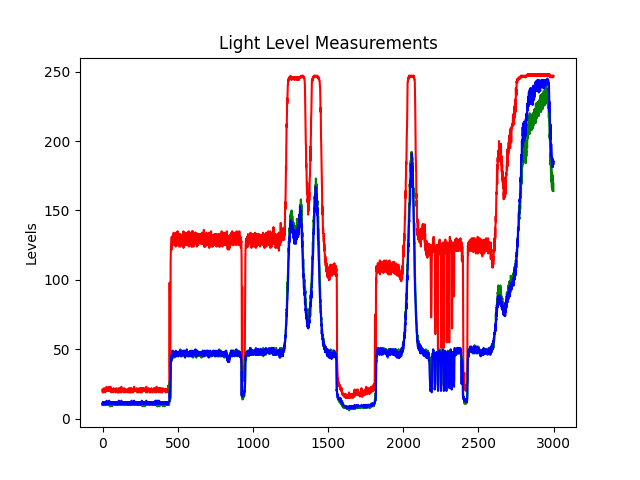
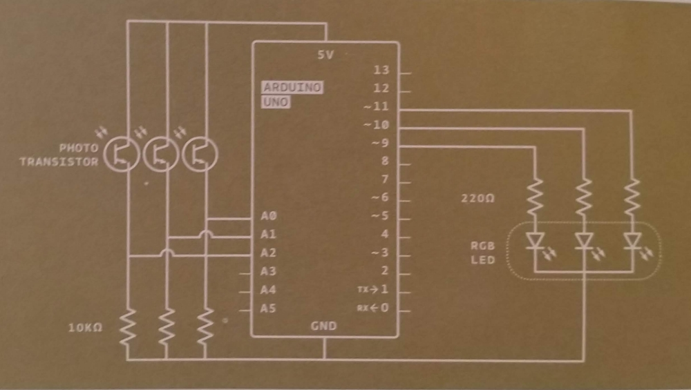
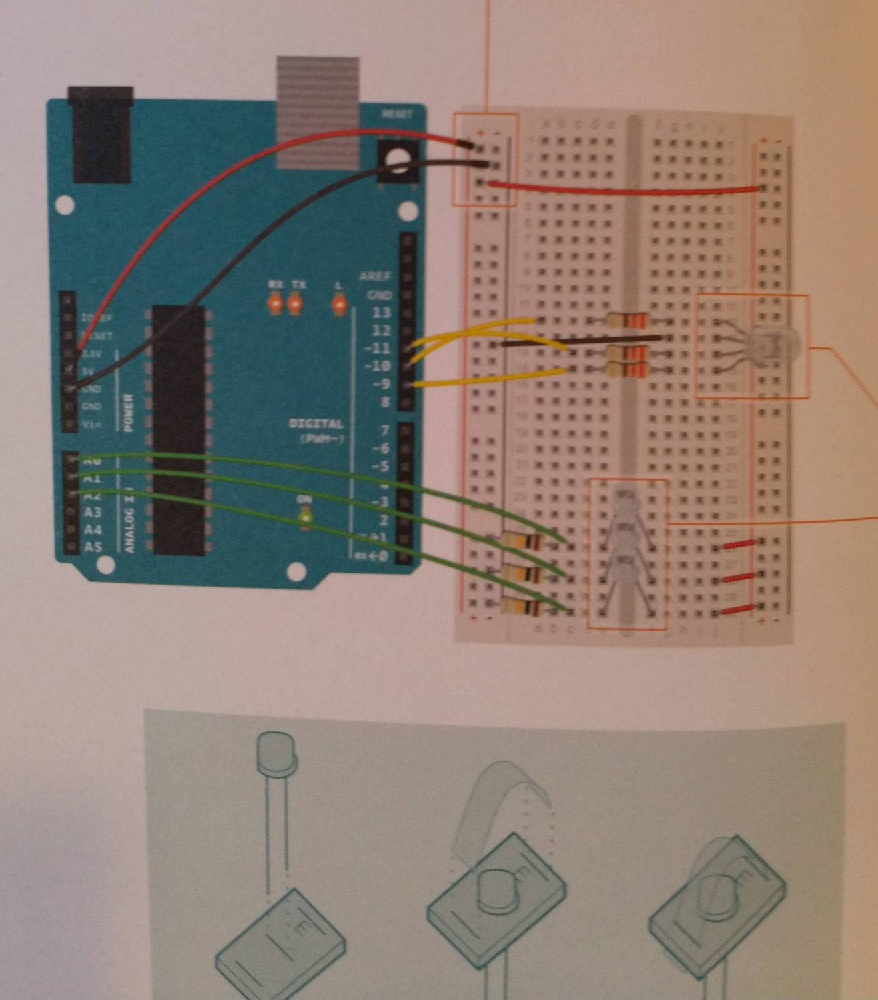

# Arduino Color Mixing Lamp Extension



## Purpose

This repo is an extension for the Arduino Starter Kit Project 4 - Color Mixing Lamp. I added real time data charting.

## Requirements

* Arduino Uno

## Usage

```
arduino-cli compile --fqbn arduino:avr:uno .
arduino-cli upload -p /dev/ttyAMC0 --fqbn arduino:avr:uno .

python3 -m venv venv
source venv/bin/activate
pip install -r requirements.txt
python execute.py
```

## Circuit Guides



